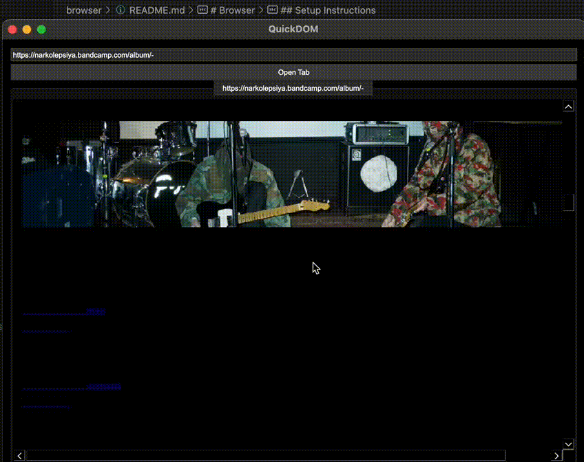

# Browser

A simple web browser built with C++ and Qt, featuring HTML parsing, rendering, and network capabilities. This project includes a comprehensive test suite using Google Test and Google Mock.

Rendering text and pictures from [https](https://www.nature.com/) (PLEASE, WAIT 2-3SEC FOR GIFS LOADING!)

Navigating to a link from the page 

## Prerequisites

- macOS (tested on macOS Ventura 13.0+)
- Xcode Command Line Tools (`xcode-select --install`)
- Homebrew (installed automatically by `setup.sh`)

## Dependencies

- **Qt 5**: GUI framework
- **libcurl**: Network requests
- **Google Test/Google Mock**: Unit testing

## Setup Instructions

1. **Clone the repository**:
   git clone https://github.com/yourusername/QuickDOM.git
   cd browser/src

2. **Run the setup script**:
   chmod +x setup.sh
   ./install_dependencies.sh

   This script installs Qt 5, libcurl, Google Test, and Google Mock, then configures the build environment.

3. **Build the project**:
    chmod +x build.sh
    ./build.sh

4. **Run the application**:
    chmod +x run.sh
    ./run.sh
5. **Run tests**:
    chmod +x run_tests.sh
   ./run_tests.sh

   This runs 55 unit tests covering HTML parsing, network, rendering, browser window, and link label functionality.